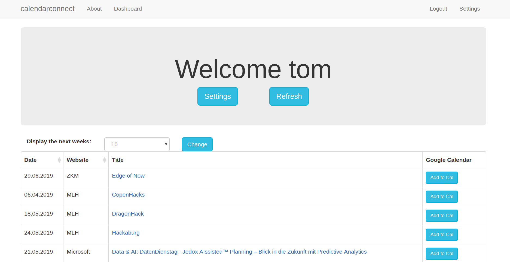
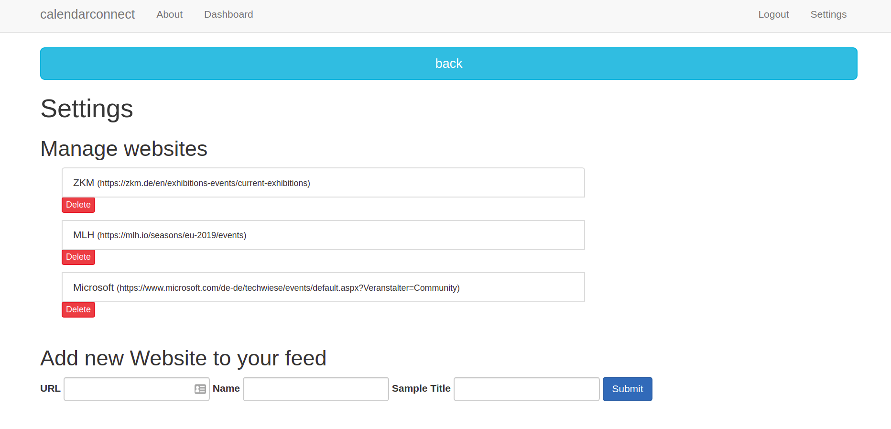

# calendarconnect
Part of the Hackathon *Hacktival 2019* in Karlsruhe

### Idea
Our aim was to build a simple webapp which can collect and display Events from a variety of different websites. 
Since many websites don't provide RSS feeds it can be a tedious task to stay on top of all events one wants to follow - a process which oftentimes involves opening 10+ different websites and seeing if new events have been posted.

Our idea was to build a simple webscraper which sifts through the user-provided websites and collects all the events on the webpage. As all websites are structured differently, we ask to user to provide one example of an event from the corresponding website and use this information as the template for the webscraping.

### Implementation
We build a simple website using **Flask** for the backend and the **Bootstrap** environment for the frontend. The webscraper was build using the python library **BeauitfulSoup**. The database handling was done using **SQLite**.

### Interface
The websites supports user profiles. A user can add websites to watch in the settings (see below) which are then saved in a database and displayed in a table as shown below.

In the settings, all the websites are displayed and the user can add new websites. Here a sample event from the website has to be provided so the webscraper can find the events.

### Next steps
* Expanding the functionality
    * As the webscraper works by providing an example it can be expanded to collect not only events but also news, blogs, videos, etc. One could therefore create a more general website which collects any sort of content (and not just events)
* Features which are almost finished:
    * We have almost finished the functionality to directly import the events into one's Google Calendar 
    * Another feature which would allow the user to upload an image of an event-poster which will then be analyzed by an text-recognition program and subsequently imported into the user events is running and has to be inserted into the website

